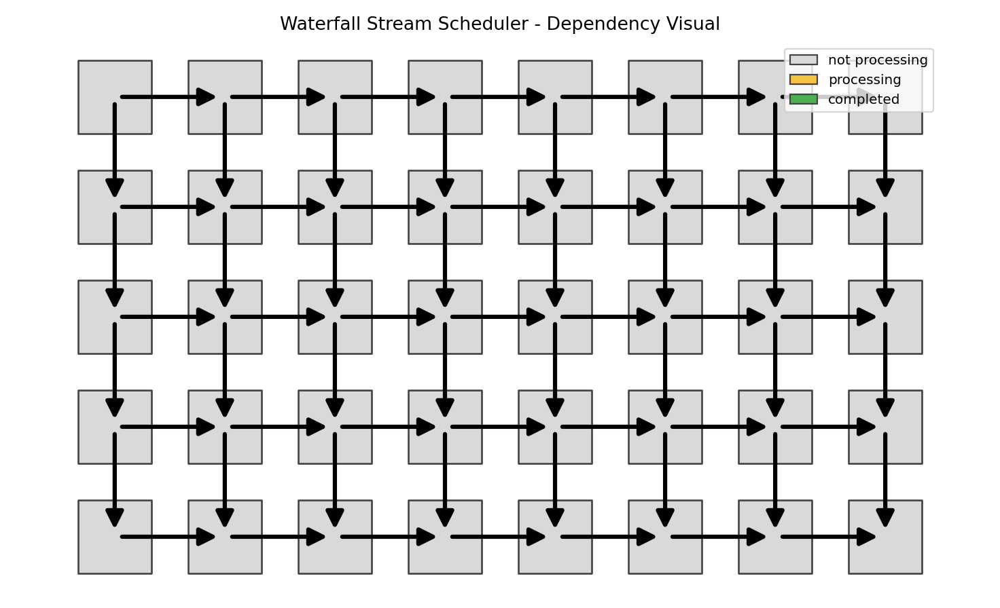

# Async Utils

A small collection of async utilities that add safer, higher-level patterns on top of `asyncio` for mixing sync and async code, streaming results, and coordinating complex dependency graphs.

## Utilities

### Link
A resilient version of `asyncio.gather` that accepts a mix of coroutines, awaitables, sync callables, and plain values, evaluates everything, and returns the results in order without failing on non-awaitables.

### Completion Funnel
An extension of `asyncio.as_completed` that works over an async generator/iterator, continuously funnels in new tasks, and yields results as they complete, making it easier to implement streaming-style pipelines and rolling concurrency. 

### Waterfall Stream Scheduler
A grid-based scheduler, ensuring that all required historical dependencies (rows/columns in the grid) have completed, while still allowing maximum concurrency where possible.

For concrete examples, usage patterns, and more in-depth explanations of each utility, see [demos](demos.md).
